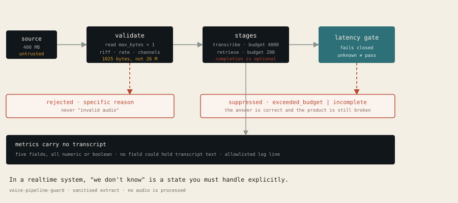

# voice-pipeline-guard

**Bounded audio capture and a fail-closed latency gate for realtime voice pipelines.**

A realtime voice agent has a failure mode unit tests do not catch: everything
works, but slowly. The transcript is correct, the answer is correct, and the user
gave up four seconds ago.

This module treats **timing as a correctness property**. A stage that overruns its
budget has not been "slow" — it has failed, and the pipeline says so instead of
passing a stale result forward.



```bash
pip install pytest
python -m pytest                              # 16 tests
PYTHONPATH=src python -m audio_guard.demo    # the walkthrough below, live
```

No dependencies. No API keys. No audio files. Python 3.10+.

---

## Why this exists

Two boundary mistakes show up repeatedly in voice pipelines, and both are
invisible until production:

**1. Checking a limit after you have already paid for it.**
Reading a 400 MB upload in full, then discovering it exceeds the limit, is a
memory-exhaustion bug that looks like a validation rule. The limit has to bound
the *read*.

**2. Reporting a result the pipeline cannot vouch for.**
If transcription took 9 seconds against a 4-second budget and you display the
answer anyway, the number is "correct" and the product is broken. There is no
way to debug that from logs, because nothing in the logs is wrong.

## What it does

```
capture ──▶ validate ──▶ stage ──▶ latency gate ──▶ display?
  bytes      reason        ms         verdict         yes / no
```

| Piece | Guarantee |
|---|---|
| `read_capture` | Never reads more than `max_bytes + 1`. Every rejection names a specific cause. |
| `LatencyGate` | `displayable` is the single question the UI asks. Unknown measurement is not a pass. |
| `UtteranceMetrics` | Has no field that could hold a transcript. The leak is unrepresentable, not merely discouraged. |

## The walkthrough

```
1. The read is bounded before it happens
  400 MB upload, 1 KB limit          REJECT  too_large
  bytes requested from the source   1025
                                    not 26,214,400 — the limit bounds the read

2. Rejections are specific, never "invalid audio"
  not a wav                         REJECT  not_a_wav
  8 kHz instead of 48 kHz            REJECT  wrong_sample_rate
  stereo instead of mono            REJECT  wrong_channel_count
  zero frames                       REJECT  empty
  48 kHz mono, 0.1 s                ACCEPT  0.1s

3. Latency is a correctness property
  transcribe 1.2s / retrieve 0.12s  DISPLAY    within_budget
  transcribe 1.2s / retrieve 1.7s   SUPPRESS   exceeded_budget
  no measurement at all             SUPPRESS   incomplete

4. Metrics carry no transcript
  audio_to_final_ms=1210 answer_retrieval_ms=140 total_to_display_ms=1360 displayable=true
```

## Three things worth reading the code for

**1. One byte past the limit.**

```python
probe = read(max_bytes + 1)
if len(probe) > max_bytes:
    return CaptureResult(accepted=False, rejection=Rejection.TOO_LARGE)
```

Reading `max_bytes + 1` makes "exactly at the limit" distinguishable from "over
the limit", while never materialising more than one byte beyond the bound. The
oversized payload is never held in memory.

**2. Unknown is not a pass.**

```python
@property
def verdict(self) -> Verdict:
    if not self.stages:
        return Verdict.INCOMPLETE
    if any(s.elapsed_ms is None for s in self.stages):
        return Verdict.INCOMPLETE
    ...
```

An empty gate and an unfinished stage both report `INCOMPLETE` and both suppress
output. The most common real bug in this class of system is a gate that returns
"fine" when it has no idea — `completed_at_ms` is deliberately optional so that a
stage which started and never reported is representable, and therefore catchable.

**3. The schema is the control.**

`UtteranceMetrics` has exactly five fields, all numeric or boolean. There is no
`transcript`, no `question_text`, no `audio_bytes`. Redaction rules written as
"don't log the transcript" fail eventually, at 2am, at the one call site someone
added in a hurry. A type with nowhere to put the value does not.

```python
def as_log_line(self) -> str:
    # Explicit allowlist. Anything not named here cannot be logged.
    return f"audio_to_final_ms={self.audio_to_final_ms} ..."
```

## Limitations

- **WAV only.** No WebM, no Opus, no raw PCM. The header check is the point, and
  it is only implementable for a container with a fixed layout.
- **The gate measures, it does not cause.** It reports overrun; making the
  pipeline faster is the caller's problem.
- **Budgets are static.** Real budgets should depend on input length. A fixed
  number is a simplification that will be wrong for very short and very long
  inputs.
- **Timing is wall-clock and therefore not deterministic under load.** Tests
  inject timestamps rather than sleeping, which means they verify the logic and
  not the scheduling.
- **No audio is actually processed.** This validates boundaries and latency
  accounting. It does not transcribe anything.

## Provenance

A standalone public proof derived from a private realtime voice
interview-practice tool. It preserves the bounded-capture, fail-closed latency,
and metadata-only logging constraints while removing provider integration, UI,
hardware routing, and deployment-specific code. The public module is
intentionally smaller than the private system.

The full system is not public.

## If you take one thing

In a realtime system, "we don't know" is a state you have to handle explicitly.
Every place your code can fail to know something is a place it will eventually
guess.
