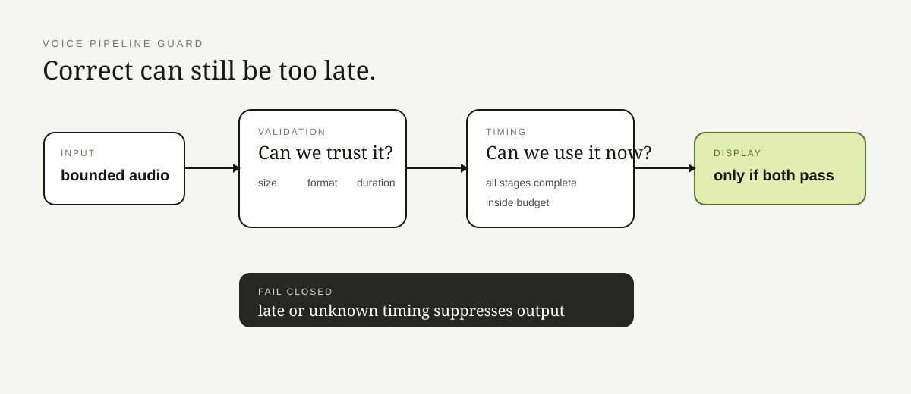

# Voice Pipeline Guard

**A correct answer delivered after the caller hangs up is technically impressive and commercially useless.**

This repo isolates two boundaries from realtime voice work:

1. audio limits must be enforced **before** reading the whole payload;
2. latency can make an otherwise correct result invalid.

## What the code protects

- oversized capture reads;
- malformed or unsupported WAV input;
- incomplete pipeline stages;
- over-budget stages;
- transcript-shaped data accidentally entering metrics.

The package is now split by responsibility:

| Area | Responsibility |
|---|---|
| `models.py` | constants, rejection reasons, result types |
| `capture.py` | bounded read + WAV validation |
| `latency.py` | stage timing and fail-closed display gate |
| `metrics.py` | metadata-only log record |
| `tests/` | capture, latency, and privacy behavior |
| `docs/` | design reasoning |

## Why “unknown” is not good enough

Realtime code often has a dangerous default: if timing data is missing, the UI carries on.

This repo does the opposite.

Missing completion time means the result is **incomplete**. Over budget means **suppress**. Only fully accounted-for stages inside budget are displayable.

The public slice contains no provider SDK, live audio, transcript, API key, or deployment plumbing.

Want to inspect the failure path? Read the [invariants](docs/invariants.md), [failure modes](docs/failure-modes.md), [latency contract](docs/latency-contract.md), and [late-answer walkthrough](docs/walkthrough.md).

> “Eventually” is not a realtime SLA.

## Inspect deeper

- [Design overview](docs/overview.md)
- [Why the design looks this way](docs/decisions.md)
- [Invariants that must survive refactors](docs/invariants.md)
- [How it fails on purpose](docs/failure-modes.md)
- [Security / privacy boundary](SECURITY.md)
- [Where this public slice came from](PROVENANCE.md)

The README is the front door. The interesting arguments are in those files.
