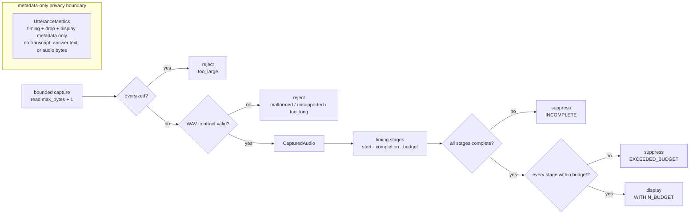

# Voice Pipeline Guard

A Python implementation of two realtime voice boundaries: **bound capture before accepting it**, and **suppress output when timing evidence is missing or over budget**.

This public repo uses synthetic WAV inputs only. It does **not** include a live provider, microphone stream, transcript pipeline, credentials, or deployment integration.

*In realtime systems, “eventually” is a suspiciously expensive word.*

## Data and timing flow

The metrics box is a separate schema boundary, not an implied live logging pipeline. No provider, microphone, transcript, or transport step appears because this repository does not implement those pieces.

## What is enforced

1. **Capture/input validation** — `read_capture()` performs a bounded probe, rejects oversized input, then validates the WAV contract before returning `CapturedAudio`.
2. **Processing/timing completeness** — callers record stage start/completion times and budgets in `LatencyGate`.
3. **Display eligibility** — no stages, missing/invalid completion time, or any over-budget stage makes `displayable == False`; only `WITHIN_BUDGET` may display.
4. **Metadata-only boundary** — `UtteranceMetrics` has fields for timing, dropped audio, and displayability; it has no transcript, answer-text, or audio-bytes field.

Capture rejection reasons include `too_large`, `not_a_wav`, unsupported WAV properties, `empty`, `truncated`, and `too_long`.

## Review the implementation

- [`src/audio_guard/capture.py`](src/audio_guard/capture.py) — bounded read + WAV validation
- [`src/audio_guard/latency.py`](src/audio_guard/latency.py) — stage timing + display verdict
- [`src/audio_guard/metrics.py`](src/audio_guard/metrics.py) — metadata-only schema
- [`tests/`](tests/) — failure-path and privacy checks
- [`docs/latency-contract.md`](docs/latency-contract.md) — verdict contract

## Evidence and scope

CircleCI is configured to compile the public source, run the behavior tests, and execute the synthetic walkthrough. Exact local commands and expected checks: [docs/verification.md](docs/verification.md).

The code demonstrates guard behavior under synthetic inputs. It does not claim production latency, call quality, provider uptime, live audio wiring, or current deployment. See [`PROVENANCE.md`](PROVENANCE.md) and [`SECURITY.md`](SECURITY.md) for the public/private boundary.